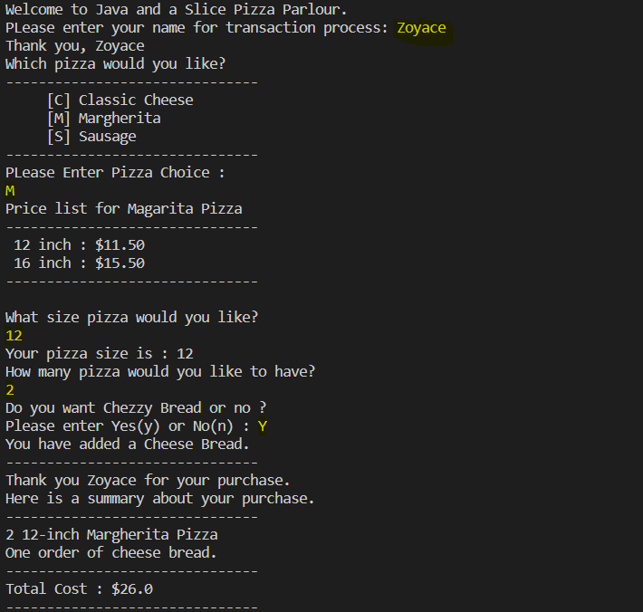

# ORDERING PIZZA

## Screen

## Description

This is a basic project that you can use to order a Pizza. You are given an option to select from Classic Cheese, Margherita & Sausage pizza then after you can select the size of the pizza that you desire 12inch or 16inch. Then the program will ask you for number of pizza. Finally, you might need some sides so the program will offer you for a cheese bread. Then after you complete your order program will print you the receipt.

## Language

- Java
